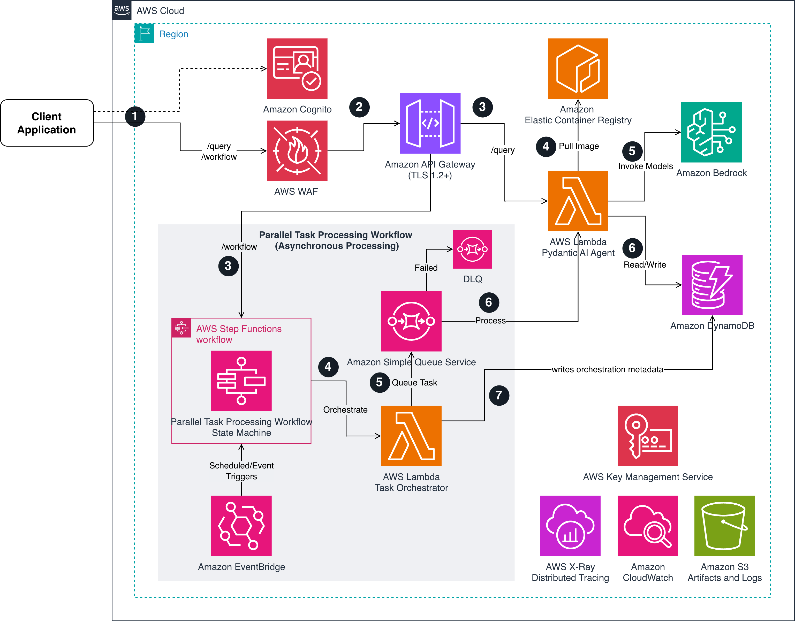

# Serverless AI Pack (Pydantic AI on AWS)

## Overview

**Serverless AI Pack** is a reference pattern that demonstrates how to deploy, scale, and monitor Pydantic AI agents on AWS using serverless architecture. It provides a framework for running type-safe AI agents that can handle business queries, data analysis, and automated decision-making tasks. The pattern leverages Amazon Bedrock for LLM capabilities, AWS Lambda for serverless execution, and native AWS services for orchestration and observability.

**Repository name**: `serverless-ai-pack`  
**Repository URL**: `https://github.com/YOUR_GITHUB_USERNAME/serverless-ai-pack`

This reference pattern demonstrates concepts for deploying AI agents in production-like environments where type safety, scalability, and cost optimization are critical. By combining Pydantic AI's type-safe agent framework with AWS's serverless ecosystem, organizations can build reliable AI systems that automatically scale based on demand while maintaining strict data validation and error handling.

> **⚠️ Important Disclaimer**: This is a reference architecture for demonstration and learning purposes. The security implementations (AWS WAF and Amazon Cognito) are configured with **foundational settings** to satisfy basic security requirements. **This is NOT production-ready**. Before deploying to production, you must:
> - Enhance WAF rules based on your specific threat model
> - Implement comprehensive Cognito user management and MFA
> - Add additional security layers (API keys, custom authorizers, etc.)
> - **Implement Amazon Bedrock Guardrails for content filtering and PII redaction**
> - Conduct thorough security reviews and penetration testing
> - Follow AWS Well-Architected Framework security best practices

## Prerequisites

- AWS Account with Bedrock access (Claude 3.5 Sonnet enabled)
- Python 3.10+
- Docker with buildx support
- AWS CDK CLI (`npm install -g aws-cdk`)
- AWS CLI configured with appropriate credentials
- ECR repository access for container images

**Tested on**: macOS (darwin) and Linux. Scripts use cross-platform compatible commands.

## Architecture

This implementation uses a fully serverless architecture with async processing capabilities:



## User Flow

### Simple Query Flow (Synchronous Processing)

**Step 1: Client Request**
- Client application sends POST request to `/query` endpoint
- Request includes: question text, optional context object, and JWT token in Authorization header
- Example: `POST https://api-id.execute-api.us-east-1.amazonaws.com/prod/query`
- TLS 1.2+ encryption ensures secure transmission

**Step 2: Security and Authentication (Parallel)**
- **AWS WAF**: Validates request against security rules
  - Rate limiting: Maximum 100 requests per 5 minutes per IP
  - AWS Managed Core Rule Set: OWASP Top 10 protection
  - Blocks malicious requests before reaching API Gateway
- **Amazon Cognito**: Validates JWT token in Authorization header
  - Verifies token signature, expiration, and user status
  - Invalid/expired tokens receive 401 Unauthorized response

**Step 3: API Gateway Routing**
- Amazon API Gateway routes validated and authenticated request to Lambda
- Request has passed both WAF and Cognito validation

**Step 4: Container Image Loading**
- AWS Lambda pulls Docker container image from Amazon ECR (cold start only)
- Image reference: `latest` tag from `pydantic-ai-agent` repository (or specific digest for production)
- Lambda initializes Python 3.11 runtime with Pydantic AI dependencies

**Step 5: AI Inference**
- AWS Lambda Pydantic AI Agent processes the query using type-safe Pydantic models
- Agent invokes Amazon Bedrock API with model ID: `us.anthropic.claude-3-5-sonnet-20241022-v2:0`
- Bedrock returns AI-generated response with structured output
- **Note**: Bedrock Guardrails not implemented - add for content filtering/PII redaction if needed

**Step 6: Result Persistence and Response**
- Lambda Agent stores result in Amazon DynamoDB table (encrypted with KMS)
- Partition key: `user_id`, Sort key: `session_id`
- Lambda returns JSON response to API Gateway with answer, confidence score, and model used
- API Gateway forwards response to client
- AWS X-Ray captures distributed trace across all services
- CloudWatch logs structured JSON with execution details

### Parallel Task Processing Flow (Asynchronous Processing)

> **Note**: Steps 1-2 (Client → WAF + Cognito → API Gateway) are identical to Simple Query Flow.

**Step 1: Workflow Request**
- Client sends POST request to `/workflow` endpoint
- Request includes: array of tasks, user_id, task metadata, and JWT token in Authorization header
- Example: `POST https://api-id.execute-api.us-east-1.amazonaws.com/prod/workflow`
- TLS 1.2+ encryption ensures secure transmission

**Step 2: Security and Authentication (Parallel)**
- AWS WAF validates request against security rules (rate limiting, OWASP protection)
- Amazon Cognito validates JWT token
- Blocked or unauthorized requests never reach backend services

**Step 3: API Gateway to Step Functions**
- Amazon API Gateway routes authenticated workflow request to Step Functions
- API Gateway assumes IAM role to invoke AWS Step Functions
- Triggers `StartExecution` on Task Processing Workflow State Machine

**Step 4: Step Functions Orchestration**
- AWS Step Functions state machine begins execution
- Generates unique execution ARN and timestamp
- Invokes Task Orchestrator Lambda function with task payload

**Step 5: Task Queuing**
- Orchestrator Lambda receives tasks array
- Iterates through tasks and sends each as individual message to Amazon SQS queue (encrypted with KMS)
- SQS queue configured with 5-minute visibility timeout, 7-day retention
- Dead Letter Queue (DLQ) captures failed messages after 3 attempts

**Step 6: Async Task Processing**
- SQS Event Source Mapping triggers Pydantic AI Agent Lambda (asynchronously)
- Agent Lambda processes each task following the same flow as Simple Query Flow:
  - **Container Loading**: Pulls Docker image from ECR (cold start only)
  - **AI Inference**: Invokes Amazon Bedrock for AI processing
  - **Result Storage**: Stores task results in DynamoDB (encrypted with KMS) with `user_id` and `session_id` (message ID)
  - **Note**: Bedrock Guardrails not configured - implement for production content safety
- Batch size: 10 messages with 5-second batching window
- Successfully processed messages deleted from queue
- Failed messages remain in queue for retry or DLQ routing

**Step 7: Orchestration Metadata Storage**
- Orchestrator Lambda writes execution metadata to DynamoDB (encrypted with KMS)
- Metadata includes: `execution_id`, `status`, `task_count`, `queued_tasks`
- Keys: `user_id` (partition), `session_id` (execution_id as sort key)
- Step Functions completes and returns execution ARN to client
- Client receives immediate response while tasks process asynchronously in Step 6
- CloudWatch Logs captures complete execution history
- AWS X-Ray provides end-to-end distributed trace across all services

## Authentication

> **⚠️ Reference Implementation**: This Cognito setup is a **basic implementation** for demonstration purposes. For production use, you should implement: MFA (Multi-Factor Authentication), advanced password policies, account recovery mechanisms, user groups/roles, federated identity providers, and comprehensive user lifecycle management.

All API endpoints are protected by **Amazon Cognito** authentication using JWT tokens. This ensures only authorized users can access the AI agent services.

### Authentication Flow

1. User authenticates with Cognito User Pool (username/password)
2. Cognito returns JWT tokens (ID token, access token, refresh token)
3. Client includes ID token in API requests: `Authorization: Bearer <token>`
4. API Gateway validates token with Cognito before invoking Lambda
5. Invalid/expired tokens receive 401 Unauthorized response

### Quick Start - Authentication

> **⚠️ Security Notice:** The credentials below (`testuser` / `TestPass123!`) are **test credentials for demonstration purposes only**. These are NOT production secrets. In production, use strong passwords, enable MFA, and follow your organization's security policies.

**Step 1: Get Cognito credentials from CDK outputs**
```bash
aws cloudformation describe-stacks \
  --stack-name PydanticAgentStack \
  --query 'Stacks[0].Outputs[?OutputKey==`UserPoolId` || OutputKey==`UserPoolClientId`]'
```

**Step 2: Create a test user (demo credentials only)**
```bash
./scripts/setup-cognito-user.sh <USER_POOL_ID> <CLIENT_ID> testuser TestPass123!
```

**Step 3: Get authentication token**
```bash
TOKEN=$(./scripts/get-cognito-token.sh <USER_POOL_ID> <CLIENT_ID> testuser TestPass123!)
```

**Step 4: Use token in API calls**
```bash
curl -X POST https://YOUR-API-ID.execute-api.us-east-1.amazonaws.com/prod/query \
  -H "Content-Type: application/json" \
  -H "Authorization: Bearer $TOKEN" \
  -d '{"question": "What is serverless?", "context": {}}'
```

### Manual Authentication (AWS CLI)

```bash
# Authenticate and get token
TOKEN=$(aws cognito-idp initiate-auth \
  --auth-flow USER_PASSWORD_AUTH \
  --client-id <CLIENT_ID> \
  --auth-parameters USERNAME=testuser,PASSWORD=TestPass123! \
  --query 'AuthenticationResult.IdToken' \
  --output text)

# Use token in requests
curl -H "Authorization: Bearer $TOKEN" <API_ENDPOINT>
```

### Token Details

- **ID Token**: Used for API authentication (1 hour validity)
- **Access Token**: Used for Cognito user operations (1 hour validity)
- **Refresh Token**: Used to get new tokens (30 days validity)

### Security Features

✅ **JWT Token Validation**: API Gateway validates tokens with Cognito before Lambda invocation
✅ **Password Policy**: Min 8 chars, uppercase, lowercase, digits required
✅ **Email Verification**: Auto-verify email addresses
✅ **Token Expiration**: 1-hour tokens prevent long-lived credential exposure
✅ **No Anonymous Access**: All endpoints require authentication

## Quick Start

### 1. Enable Bedrock Models

```bash
# Request access to Claude models in AWS Console
# Navigate to: Amazon Bedrock > Model access
# Enable: Claude 3.5 Sonnet v1
```

### 2. Install Dependencies

```bash
# Create and activate virtual environment
python -m venv venv
source venv/bin/activate  # On Windows: venv\Scripts\activate

# Install dependencies
pip install -r requirements.txt
pip install -r cdk-requirements.txt
```

### 3. Create ECR Repository and Build Docker Image

```bash
# Make scripts executable (required for testing and deployment)
chmod +x scripts/*.sh

# Create ECR repository
aws ecr create-repository --repository-name pydantic-ai-agent --region us-east-1

# Authenticate Docker to ECR
aws ecr get-login-password --region us-east-1 | docker login --username AWS --password-stdin <YOUR-ACCOUNT-ID>.dkr.ecr.us-east-1.amazonaws.com

# Build Docker image for Lambda (linux/amd64 platform)
docker buildx build --platform linux/amd64 --provenance=false --sbom=false -t pydantic-ai-agent:latest .

# Tag and push to ECR
docker tag pydantic-ai-agent:latest <YOUR-ACCOUNT-ID>.dkr.ecr.us-east-1.amazonaws.com/pydantic-ai-agent:latest
docker push <YOUR-ACCOUNT-ID>.dkr.ecr.us-east-1.amazonaws.com/pydantic-ai-agent:latest
```

> **Note**: The CDK stack uses the `latest` tag by default. For production, update `cdk/stacks/agent_stack.py` to use a specific image digest for immutability.

### 4. Deploy Infrastructure

```bash
# Bootstrap CDK (first time only)
cd cdk && cdk bootstrap

# Deploy the stack
cd cdk && cdk deploy
```

> **Note**: All CDK commands must be run from the `cdk/` directory.

### 5. Setup Authentication

> **⚠️ Security Notice:** The credentials below (`testuser` / `TestPass123!`) are **test credentials for demonstration purposes only**. These are NOT production secrets. In production, use strong passwords, enable MFA, and follow your organization's security policies.

```bash
# Get Cognito details from stack outputs
USER_POOL_ID=$(aws cloudformation describe-stacks --stack-name PydanticAgentStack --query 'Stacks[0].Outputs[?OutputKey==`UserPoolId`].OutputValue' --output text)
CLIENT_ID=$(aws cloudformation describe-stacks --stack-name PydanticAgentStack --query 'Stacks[0].Outputs[?OutputKey==`UserPoolClientId`].OutputValue' --output text)

# Create test user (demo credentials only)
./scripts/setup-cognito-user.sh $USER_POOL_ID $CLIENT_ID testuser TestPass123!

# Get authentication token
TOKEN=$(aws cognito-idp initiate-auth \
  --auth-flow USER_PASSWORD_AUTH \
  --client-id $CLIENT_ID \
  --auth-parameters USERNAME=testuser,PASSWORD=TestPass123! \
  --query 'AuthenticationResult.IdToken' \
  --output text)

echo "Token: $TOKEN"
```

### 6. Test the Deployment

#### Direct Query (Synchronous)

```bash
# Get API endpoint and token
API_ENDPOINT=$(aws cloudformation describe-stacks --stack-name PydanticAgentStack --query 'Stacks[0].Outputs[?OutputKey==`QueryEndpoint`].OutputValue' --output text)

# Make authenticated request
curl -X POST $API_ENDPOINT \
  -H "Content-Type: application/json" \
  -H "Authorization: Bearer $TOKEN" \
  -d '{
    "question": "What are the benefits of serverless architecture?",
    "context": {}
  }'
```

Expected response:
```json
{
  "answer": "Serverless architecture offers several key benefits...",
  "confidence": 0.95,
  "model_used": "us.anthropic.claude-3-5-sonnet-20241022-v2:0"
}
```

#### Workflow Execution (Asynchronous)

```bash
# Get workflow endpoint
WORKFLOW_ENDPOINT=$(aws cloudformation describe-stacks --stack-name PydanticAgentStack --query 'Stacks[0].Outputs[?OutputKey==`WorkflowEndpoint`].OutputValue' --output text)

# Start a parallel task processing workflow with authentication
curl -X POST $WORKFLOW_ENDPOINT \
  -H "Content-Type: application/json" \
  -H "Authorization: Bearer $TOKEN" \
  -d '{
    "tasks": [
      {
        "task_type": "research",
        "data": {"topic": "Machine Learning"}
      },
      {
        "task_type": "analysis",
        "data": {"dataset": "sales_data"}
      }
    ],
    "user_id": "user-123"
  }'
```

Expected response:
```json
{
  "executionArn": "arn:aws:states:us-east-1:123456789012:execution:AgentOrchestration...",
  "startDate": "1.76586909083E9"
}
```

> **Note**: Workflow requests require `user_id` field. Test events in `tests/events/` follow this structure.

#### Run Tests

#### Run Tests

> **⚠️ Test Credentials Setup**: Integration tests require test credentials to be set as environment variables. **Do NOT hardcode credentials in test files.**
> 
> **Setup test credentials:**
> ```bash
> export TEST_USERNAME="testuser"
> export TEST_PASSWORD="TestPass123!"
> ```
> 
> These are **demo credentials for testing only**. In production, use strong passwords and enable MFA.

**Local Unit Tests**:
```bash
./scripts/test-local.sh
```
Runs unit tests with coverage reporting (excludes infrastructure tests).

**Verify Bedrock Access**:
```bash
./scripts/test-bedrock-access.sh
```
Checks if you have access to required Bedrock models.

**Test Deployed Infrastructure**:
```bash
./scripts/test-aws.sh
```
Tests the deployed AWS stack (API Gateway, Step Functions, CloudWatch logs).

**Integration Tests with Authentication**:
```bash
# Set test credentials first
export TEST_USERNAME="testuser"
export TEST_PASSWORD="TestPass123!"

# Run integration tests
./scripts/test-with-auth.sh
```
Comprehensive integration test suite with Cognito authentication.

**Manual Tests**:
```bash
# Run pytest directly
pytest tests/ -v

# Run integration tests (requires manual token setup)
./tests/test_integration.sh
```

These tests cover: API Gateway, Lambda, Step Functions, SQS, DynamoDB, and authentication.

## Cleanup

### Clean Local Files

Remove temporary files, build artifacts, and cached data without affecting AWS infrastructure:

```bash
./scripts/cleanup-local.sh
```

This removes:
- Python cache files (`__pycache__`, `*.pyc`)
- Test artifacts (`.pytest_cache`, `.coverage`)
- CDK build artifacts (`cdk/cdk.out/`)
- OS-specific files (`.DS_Store`, `Thumbs.db`)
- Temporary files (`*.tmp`, `*.log`, `*.bak`)

### Destroy AWS Infrastructure

Remove all AWS resources created by this project:

```bash
./scripts/destroy-infrastructure.sh
```

This script will:
1. Show a warning with all resources to be destroyed
2. Require explicit confirmation (`yes`)
3. Destroy the CDK stack (Lambda, API Gateway, Step Functions, SQS, DynamoDB, Cognito, WAF, IAM roles)
4. Provide instructions for manual cleanup of ECR and CloudWatch logs

**Note**: The script includes safety prompts to prevent accidental deletion.

## Project Structure

```
.
├── lambda/
│   ├── agent.py                    # Agent Lambda (handles API Gateway & SQS events)
│   └── task_orchestrator.py        # Task Orchestrator (queues tasks to SQS for parallel processing)
├── cdk/
│   ├── app.py                      # CDK app entry point
│   └── stacks/
│       └── agent_stack.py          # Complete infrastructure definition
├── scripts/
│   ├── cleanup-local.sh            # Clean local build artifacts and temp files
│   ├── destroy-infrastructure.sh   # Destroy all AWS resources
│   ├── setup-cognito-user.sh       # Create Cognito test user
│   ├── get-cognito-token.sh        # Get JWT authentication token
│   ├── test-with-auth.sh           # Run integration tests with authentication
│   ├── test-aws.sh                 # Test deployed AWS infrastructure
│   ├── test-bedrock-access.sh      # Verify Bedrock model access
│   └── test-local.sh               # Run local unit tests
├── tests/
│   ├── test_agent.py               # Agent Lambda tests
│   ├── test_agent_unit.py          # Agent unit tests
│   ├── test_orchestrator.py        # Orchestrator & status handler tests
│   ├── test_infrastructure.py      # CDK infrastructure tests
│   ├── test_integration.sh         # End-to-end integration tests
│   ├── conftest.py                 # Shared test fixtures
│   └── events/
│       └── test-orchestration-event.json  # Sample workflow event (requires user_id)
├── images/
│   └── architecture-diagram.png    # Architecture diagram
├── Dockerfile                      # Lambda container image (shared by both Lambda functions)
├── requirements.txt                # Python dependencies
├── lambda-requirements.txt         # Lambda-specific dependencies
├── cdk-requirements.txt            # CDK dependencies
└── README.md                       # This file
```

## Features

### Type-Safe Inputs/Outputs
All agent interactions use Pydantic models for validation:

```python
class QueryInput(BaseModel):
    question: str
    context: Optional[dict] = None

class AgentResponse(BaseModel):
    answer: str
    confidence: float
    model_used: str
```

### Agent Tools

The Pydantic AI agent has access to three built-in tools for data persistence, context retrieval, and order management:

**1. get_order_status** - Looks up order information by order ID
```python
@agent.tool
async def get_order_status(ctx: RunContext[AgentDependencies], order_id: str) -> dict:
    """Look up order status and details by order ID."""
```

**2. get_user_history** - Retrieves recent conversation history
```python
@agent.tool
async def get_user_history(ctx: RunContext[AgentDependencies], user_id: str, limit: int = 10) -> list:
    """Retrieve recent conversation history for a user."""
```

**3. store_result** - Saves agent responses for future reference
```python
@agent.tool
async def store_result(ctx: RunContext[AgentDependencies], result: dict) -> bool:
    """Store agent result in DynamoDB for future reference."""
```

**How tools work:**
- The agent automatically decides when to use tools based on the query
- Tools are mentioned in the system prompt to encourage usage
- Example: If user asks "Where is order ORD-001?", agent uses `get_order_status`
- Example: If user asks "What did we discuss before?", agent uses `get_user_history`
- All tool calls are logged in CloudWatch for debugging

**Example query that triggers tool usage:**
```bash
# Order status inquiry - triggers get_order_status tool
curl -X POST $API_ENDPOINT \
  -H "Authorization: Bearer $TOKEN" \
  -d '{"question": "What is the status of my order ORD-001?", "context": {}}'

# Conversation history - triggers get_user_history tool
curl -X POST $API_ENDPOINT \
  -H "Authorization: Bearer $TOKEN" \
  -d '{"question": "What did we discuss in our last conversation?", "context": {}}'
```

The agent will automatically call the appropriate tool based on the question.

### Dual Processing Modes

1. **Synchronous (`/query`)**: Direct Lambda invocation for immediate responses
2. **Asynchronous (`/workflow`)**: Step Functions + SQS for parallel processing

### Single Docker Image Architecture

Both Lambda functions (Agent and Orchestrator) use the **same Docker image** from ECR with different entry points:

- **Agent Lambda**: Uses default entry point `agent.handler`
  - Handles direct API Gateway requests (`/query` endpoint)
  - Processes SQS messages from the agent queue (batch processing)
  
- **Orchestrator Lambda**: Uses custom entry point `task_orchestrator.handler`
  - Invoked by Step Functions for workflow orchestration
  - Queues tasks to SQS for async processing

This approach provides:
- **Simplified deployment**: Single image to build, tag, and push
- **Consistent dependencies**: Both functions use identical Python packages
- **Reduced maintenance**: Update once, deploy everywhere
- **Cost efficiency**: Single ECR repository, shared image layers

### Event Source Integration

The Agent Lambda supports both API Gateway and SQS events:

```python
def handler(event, context):
    if 'Records' in event:
        return handle_sqs_event(event, context)  # Batch processing
    else:
        return handle_api_event(event, context)  # Direct invocation
```

### Reliability Features

- **Automatic Retries**: Exponential backoff (3 attempts, 2x backoff rate)
- **Dead Letter Queue**: Failed messages preserved for analysis
- **Batch Item Failures**: Partial batch success with selective retry
- **Circuit Breaker**: Prevents cascading failures
- **Idempotency**: Safe to retry operations

### Observability

- **AWS X-Ray**: Distributed tracing across all services
- **CloudWatch Logs**: Structured JSON logging with context
- **CloudWatch Metrics**: Custom metrics for performance tracking
- **Execution Tracking**: All workflows tracked in DynamoDB
- **Step Functions Logging**: Complete execution history with input/output data

## Real-World Use Case: Customer Service Agent

This pattern includes a complete customer service implementation demonstrating practical usage of Pydantic AI agents with tools.

### Scenario

An e-commerce company needs an AI-powered customer service agent that can:
- Answer customer questions about orders
- Look up order status and tracking information
- Provide helpful, empathetic responses
- Maintain conversation context

### Implementation

The customer service agent uses:
- **Specialized system prompt** for customer service context
- **Order lookup tool** (`get_order_status`) to retrieve order information
- **Conversation history tool** (`get_user_history`) to maintain context
- **Type-safe responses** with confidence scores

### Example Interactions

**Order Status Inquiry:**
```bash
curl -X POST $API_ENDPOINT \
  -H "Authorization: Bearer $TOKEN" \
  -d '{"question": "What is the status of my order ORD-001?", "context": {}}'
```

**Response:**
```json
{
  "answer": "Your order ORD-001 has been shipped! The tracking number is 1Z999AA10123456784 and the estimated delivery date is January 8, 2026. Your order includes: Dell XPS 15 Laptop and Wireless Mouse.",
  "confidence": 0.98,
  "model_used": "us.anthropic.claude-3-5-sonnet-20241022-v2:0"
}
```

**Key Features Demonstrated:**
- ✅ Agent automatically calls `get_order_status` tool when order ID detected
- ✅ Provides detailed order information from database
- ✅ High confidence score (0.98) for database-backed answers
- ✅ Professional, empathetic customer service tone
- ✅ Graceful handling of "order not found" scenarios

### Testing the Use Case

Run the complete test suite:
```bash
./examples/customer-service/test-customer-service.sh
```

This runs 5 test scenarios:
1. Order status inquiry (shipped order)
2. Order not found handling
3. General policy question
4. Delivered order status
5. Processing order inquiry

**See `examples/customer-service/README.md` for complete documentation.**

## Parallel Task Processing

> **Important Note**: This pattern uses a **single Pydantic AI agent** that processes tasks in parallel. Multiple instances of the same agent run concurrently via SQS, but there are no specialized agents. This is parallel task processing, not a multi-agent system.

The workflow endpoint uses Step Functions to orchestrate parallel task processing with the following features:

### Features

- **Async Processing**: Tasks are queued to SQS for parallel processing
- **Automatic Retries**: Exponential backoff with 3 retry attempts
- **Error Handling**: Comprehensive error catching and logging
- **Batch Processing**: SQS processes up to 10 messages per batch
- **Dead Letter Queue**: Failed messages are moved to DLQ for analysis
- **Execution Tracking**: All workflows tracked in DynamoDB with execution IDs

### Workflow Process

1. Client sends tasks to `/workflow` endpoint
2. API Gateway triggers Step Functions
3. Task Orchestrator Lambda queues tasks to SQS
4. **Same agent** processes tasks in parallel - multiple Lambda instances handle batches of 10
5. Results stored in DynamoDB with execution tracking
6. Step Functions completes with success/failure status

**Key Point**: All tasks are processed by the same generic agent. The parallelism comes from multiple Lambda instances running concurrently, not from specialized agents.

### Monitoring Workflow Execution

```bash
# Check workflow status
aws stepfunctions describe-execution \
  --execution-arn YOUR-EXECUTION-ARN \
  --region us-east-1

# View execution history
aws stepfunctions get-execution-history \
  --execution-arn YOUR-EXECUTION-ARN \
  --region us-east-1
```

## Configuration

### API Gateway Timeout Limits

> **⚠️ Important Limitation**: API Gateway REST API has a **maximum timeout of 29 seconds**. This is a hard limit that cannot be increased.

**Impact on endpoints:**

- **`/query` endpoint (synchronous)**: 
  - Use for queries that complete in **< 25 seconds**
  - If query exceeds 29 seconds, client receives `504 Gateway Timeout`
  - Lambda continues running (wasted cost) even after timeout
  
- **`/workflow` endpoint (asynchronous)**: 
  - Use for long-running tasks (> 25 seconds)
  - Returns immediately with execution ARN
  - Tasks process asynchronously without timeout constraints

**Recommendation**: For production use, implement client-side timeout handling and use `/workflow` endpoint for any queries that might take longer than 25 seconds.

### Environment Variables

- `BEDROCK_MODEL_ID`: Model identifier (default: `us.anthropic.claude-3-5-sonnet-20241022-v2:0`)
- `DYNAMODB_TABLE`: Results table name (auto-configured by CDK)
- `LOG_LEVEL`: Logging level (INFO, DEBUG, ERROR)
- `POWERTOOLS_SERVICE_NAME`: Service name for AWS Lambda Powertools

Note: `AWS_REGION` is automatically set by Lambda runtime - do not override it in your configuration.

### Lambda Settings

- Memory: 1024 MB (adjustable based on workload)
- Timeout: 5 minutes
- Tracing: X-Ray enabled

## Performance & Scalability

### Performance Metrics

- **Cold Start**: ~2-3 seconds (containerized Lambda)
- **Warm Invocation**: ~200-500ms
- **Workflow Execution**: ~5-10 seconds (including SQS processing)
- **Throughput**: Scales to thousands of concurrent requests

### Scalability Features

- **Auto-scaling**: Lambda automatically scales based on demand
- **SQS Buffering**: Handles traffic spikes without throttling
- **Batch Processing**: Processes up to 10 messages per Lambda invocation
- **Concurrent Executions**: Configurable Lambda concurrency limits
- **DynamoDB On-Demand**: Automatically scales read/write capacity

### Optimization Tips

1. **Provisioned Concurrency**: Enable for predictable workloads to eliminate cold starts
2. **Memory Tuning**: Use AWS Lambda Power Tuning tool to find optimal memory setting
3. **Connection Pooling**: Reuse DynamoDB connections across invocations
4. **Payload Optimization**: Minimize event payload size for faster processing

## Cost Optimization

### Cost-Saving Strategies

1. **Model Selection**: Use Claude Haiku for simple tasks, Sonnet for complex reasoning
2. **Response Caching**: Implement caching for repeated queries (reduces Bedrock costs)
3. **Batch Processing**: SQS batching reduces Lambda invocations by 10x
4. **Memory Optimization**: Right-size Lambda memory (current: 1024 MB for Agent, 2048 MB for Orchestrator)
5. **Timeout Configuration**: Set appropriate timeouts to avoid unnecessary charges
6. **DynamoDB On-Demand**: Pay only for actual read/write operations

### Cost Breakdown (Estimated)

For 1 million requests/month:
- **Lambda**: ~$20 (1024 MB, 500ms avg duration)
- **Bedrock**: ~$150 (varies by token usage)
- **DynamoDB**: ~$5 (on-demand pricing)
- **API Gateway**: ~$3.50
- **Step Functions**: ~$25 (for workflow executions)
- **SQS**: ~$0.40
- **Cognito**: ~$5.50 (for 1,000 active users)
- **WAF**: ~$7.60 (Web ACL + 2 rules + 1M requests)
- **CloudWatch**: ~$5

**Total**: ~$222/month for 1M requests

## Monitoring & Observability

### CloudWatch Logs

All components log to CloudWatch with structured JSON:

```json
{
  "level": "INFO",
  "location": "handler:159",
  "message": "Processing API Gateway event",
  "timestamp": "2025-12-16 12:55:04",
  "service": "pydantic-agent",
  "cold_start": true,
  "function_name": "AgentFunction",
  "confidence": 0.95,
  "model": "claude-3-5-sonnet"
}
```

### X-Ray Tracing

Distributed tracing enabled across:
- API Gateway
- Lambda Functions (Agent, Orchestrator, CheckStatus)
- Step Functions
- DynamoDB
- Bedrock API calls

View traces in AWS X-Ray console to identify bottlenecks.

### Step Functions Execution History

Complete audit trail of all workflow executions:
- Input/output data for each state
- Execution duration and timestamps
- Error details and retry attempts
- State transitions

### Key Metrics to Monitor

1. **Lambda Metrics**:
   - Invocations, Errors, Duration
   - Concurrent Executions
   - Throttles

2. **SQS Metrics**:
   - Messages Sent/Received
   - Messages in Queue
   - DLQ Message Count

3. **Step Functions Metrics**:
   - Executions Started/Succeeded/Failed
   - Execution Duration

4. **DynamoDB Metrics**:
   - Read/Write Capacity Units
   - Throttled Requests

5. **Bedrock Metrics**:
   - Model Invocations
   - Token Usage
   - Latency

6. **WAF Metrics**:
   - Allowed Requests
   - Blocked Requests
   - Counted Requests
   - Rate Limit Blocks

### Recommended Alarms

Set up CloudWatch Alarms for:
- Lambda error rate > 5%
- Lambda duration > 3s (p99)
- SQS DLQ message count > 0
- Step Functions failed executions > 10/hour
- DynamoDB throttled requests > 0
- WAF blocked requests > 100/hour (potential attack)

## Security

> **⚠️ Production Readiness**: The security implementations in this reference architecture are intentionally minimal to demonstrate core concepts. **Do not use these configurations as-is in production**. Consult with your security team and follow your organization's security policies and compliance requirements.

### WAF Protection

> **⚠️ Reference Implementation**: This WAF configuration provides **basic protection only** with minimal rules. For production environments, you should: customize rate limits based on your traffic patterns, add geo-blocking rules if needed, implement IP whitelisting/blacklisting, add custom rules for your specific use cases, enable AWS WAF Bot Control (if needed), and regularly review and update rules based on threat intelligence.

The API Gateway is protected by AWS WAF with two security rules:

**1. Rate Limiting Rule**
- Maximum 100 requests per 5 minutes per IP address
- Automatically blocks IPs exceeding the limit
- Prevents DDoS attacks and brute force attempts
- CloudWatch metrics: `RateLimitRule`

**2. AWS Managed Core Rule Set**
- Protection against OWASP Top 10 vulnerabilities
- SQL injection prevention
- Cross-site scripting (XSS) prevention
- Local file inclusion (LFI) prevention
- Remote file inclusion (RFI) prevention
- Common attack pattern detection
- CloudWatch metrics: `AWSManagedRulesCommonRuleSet`

**Monitoring WAF Activity**:
```bash
# View blocked requests
aws wafv2 get-sampled-requests \
  --web-acl-arn <WAF_WEB_ACL_ARN> \
  --rule-metric-name RateLimitRule \
  --scope REGIONAL \
  --time-window StartTime=$(date -u -d '1 hour ago' +%s),EndTime=$(date -u +%s) \
  --max-items 100 \
  --region us-east-1

# View WAF metrics in CloudWatch
aws cloudwatch get-metric-statistics \
  --namespace AWS/WAFV2 \
  --metric-name BlockedRequests \
  --dimensions Name=WebACL,Value=PydanticAgentWAF Name=Region,Value=us-east-1 Name=Rule,Value=ALL \
  --start-time $(date -u -d '1 hour ago' +%Y-%m-%dT%H:%M:%S) \
  --end-time $(date -u +%Y-%m-%dT%H:%M:%S) \
  --period 300 \
  --statistics Sum \
  --region us-east-1
```

### IAM Security
- **Least Privilege**: Each Lambda has minimal required permissions
- **Role Separation**: Separate roles for Agent, Orchestrator, and CheckStatus
- **No Hardcoded Credentials**: All credentials managed by IAM

### Network Security
- **VPC Support**: Can be deployed in VPC with private subnets
- **VPC Endpoints**: Optional VPC endpoints for Bedrock, DynamoDB, SQS
- **API Gateway**: Built-in DDoS protection and throttling
- **WAF**: Web Application Firewall filters malicious requests before reaching API Gateway

### Data Security
- **Encryption at Rest**: DynamoDB tables encrypted by default
- **Encryption in Transit**: All API calls use HTTPS/TLS
- **SQS Encryption**: Messages encrypted in transit and at rest
- **Secrets Management**: Compatible with AWS Secrets Manager

### API Security
- **Throttling**: API Gateway rate limiting (100 req/s, 200 burst)
- **Authentication**: Supports API keys, IAM auth, or Cognito integration
- **CORS**: Configurable CORS policies
- **Input Validation**: Pydantic models validate all inputs

## Troubleshooting

### Docker Multi-Architecture Manifest Issues

If you encounter errors like "image with reference was found but does not match the specified platform":

```bash
# Build with explicit platform and disable provenance/sbom
docker buildx build --platform linux/amd64 --provenance=false --sbom=false -t pydantic-ai-agent:latest .
```

This ensures a single-platform image compatible with Lambda's linux/amd64 architecture.

### Bedrock Model Access

If you get "Could not resolve the foundation model" errors:
- Verify model access is enabled in AWS Console (Bedrock > Model access)
- Use Claude 3.5 Sonnet v2 with inference profile: `us.anthropic.claude-3-5-sonnet-20241022-v2:0`
- Note: v2 models use cross-region inference profiles (prefix: `us.`, `eu.`, etc.)

### API Gateway Timeout (504 Gateway Timeout)

If you receive `504 Gateway Timeout` errors on the `/query` endpoint:
- **Root Cause**: API Gateway has a hard 29-second timeout limit
- **Solution 1**: Use `/workflow` endpoint instead for long-running queries
- **Solution 2**: Optimize your prompt to reduce processing time
- **Solution 3**: Implement client-side retry logic with exponential backoff
- **Note**: Lambda timeout is 5 minutes, but API Gateway times out at 29 seconds

Example of switching to workflow endpoint:
```bash
# Instead of /query (synchronous, 29s limit)
curl -X POST $QUERY_ENDPOINT -d '{"question": "complex query"}'

# Use /workflow (asynchronous, no timeout)
curl -X POST $WORKFLOW_ENDPOINT -d '{"tasks": [{"task_type": "query", "data": {"question": "complex query"}}], "user_id": "user-123"}'
```

### Amazon Bedrock Guardrails

> **⚠️ Not Implemented**: Amazon Bedrock Guardrails are **NOT included** in this reference implementation. This is intentional to keep the focus on demonstrating serverless AI agent architecture patterns.

**What are Bedrock Guardrails?**

Amazon Bedrock Guardrails provide content filtering and safety controls for AI applications:

- **Content Filters**: Block hate speech, violence, sexual content, insults
- **Denied Topics**: Prevent responses on specific topics
- **Word Filters**: Block or redact specific words/phrases
- **PII Redaction**: Automatically detect and redact personally identifiable information
- **Contextual Grounding**: Reduce hallucinations with source attribution

**Recommendation for Production:**

Implement Bedrock Guardrails separately based on your specific requirements:
- Content safety policies
- Compliance requirements (GDPR, HIPAA, etc.)
- Industry regulations
- Organizational standards

**Implementation Guide**: [Amazon Bedrock Guardrails Documentation](https://docs.aws.amazon.com/bedrock/latest/userguide/guardrails.html)

### Pydantic AI API Changes

> **Note**: This project uses pydantic-ai v1.32+. If upgrading from older versions, note these API changes:

- `BedrockModel` → `BedrockConverseModel`
- `result_type` → `output_type`
- `result.data` → `result.output`
- `.dict()` → `.model_dump()`

### Cold Start Issues
- Enable Provisioned Concurrency for predictable workloads
- Optimize container size by removing unnecessary dependencies
- Implement connection pooling for DynamoDB

### Rate Limiting
- Implement exponential backoff for Bedrock API calls
- Use SQS for request queuing during high traffic
- Monitor Bedrock quotas in Service Quotas console

### High Costs
- Review token usage patterns in CloudWatch
- Optimize prompt engineering to reduce token consumption
- Implement response caching for repeated queries
- Consider using Claude Haiku for simpler tasks

## Development

### Local Testing

```bash
# Create virtual environment
python -m venv venv
source venv/bin/activate

# Install dependencies
pip install -r requirements.txt
pip install -r cdk-requirements.txt

# Run all unit tests
pytest tests/ -v

# Run tests with coverage
pytest tests/ -v --cov=lambda --cov-report=term-missing

# Run specific test suites
pytest tests/test_agent.py -v              # Agent tests
pytest tests/test_orchestrator.py -v       # Orchestrator tests
pytest tests/test_infrastructure.py -v     # Infrastructure tests

# Run integration tests (requires AWS deployment)
./tests/test_integration.sh
```

### Test Coverage

The project includes comprehensive test coverage:

- **Unit Tests**: 16 tests for Lambda functions (no AWS dependencies)
  - Agent Lambda: 8 tests
  - Orchestrator Lambda: 8 tests
  - Run with: `./scripts/test-local.sh`
  
- **Infrastructure Tests**: 22 tests for CDK stack (requires CDK in PYTHONPATH)
  - Run separately with: `pytest tests/test_infrastructure.py -v`
  
- **Integration Tests**: 4 end-to-end tests with authentication
  - Query endpoint with/without auth
  - Workflow endpoint with/without auth
  - Run with: `./scripts/test-with-auth.sh`
  - **Requires**: `TEST_USERNAME` and `TEST_PASSWORD` environment variables

> **Note**: Unit tests run locally without AWS. Infrastructure and integration tests require deployed AWS resources.
> 
> **Test Credentials**: Integration tests require environment variables:
> ```bash
> export TEST_USERNAME="testuser"
> export TEST_PASSWORD="TestPass123!"
> ```
> These are demo credentials for testing only. Never commit credentials to code.

### Testing Against AWS

```bash
# Verify AWS credentials
aws sts get-caller-identity

# Test Bedrock access
aws bedrock list-foundation-models --region us-east-1

# Test direct query endpoint
curl -X POST https://YOUR-API-ID.execute-api.us-east-1.amazonaws.com/prod/query \
  -H "Content-Type: application/json" \
  -d '{"question": "Test question", "context": {}}'

# Test workflow endpoint
curl -X POST https://YOUR-API-ID.execute-api.us-east-1.amazonaws.com/prod/workflow \
  -H "Content-Type: application/json" \
  -d '{"tasks": [{"task_type": "research", "data": {"topic": "test"}}], "user_id": "test-user"}'

# Check SQS queue
aws sqs get-queue-attributes \
  --queue-url YOUR-QUEUE-URL \
  --attribute-names ApproximateNumberOfMessages \
  --region us-east-1

# Query DynamoDB for results
aws dynamodb scan \
  --table-name YOUR-TABLE-NAME \
  --limit 5 \
  --region us-east-1
```

### Deployment Best Practices

#### Image Management

1. **Use Digests for Production**: Reference images by SHA256 digest for immutability
   ```python
   # Development (default):
   tag_or_digest="latest"  # Convenient for rapid iteration
   
   # Production:
   tag_or_digest="sha256:abc123..."  # Immutable, prevents unexpected changes
   ```

2. **Single Platform Builds**: Always build for linux/amd64
   ```bash
   docker buildx build --platform linux/amd64 --provenance=false --sbom=false
   ```

3. **ECR Lifecycle Policies**: Automatically clean up old images
   ```bash
   aws ecr put-lifecycle-policy --repository-name pydantic-ai-agent \
     --lifecycle-policy-text '{"rules":[{"rulePriority":1,"selection":{"tagStatus":"untagged","countType":"imageCountMoreThan","countNumber":3},"action":{"type":"expire"}}]}'
   ```

#### Deployment Strategy

1. **Blue/Green Deployments**: Use Lambda aliases for zero-downtime updates
2. **Canary Deployments**: Gradually shift traffic to new version
3. **Rollback Plan**: Keep previous image digest for quick rollback

#### CI/CD Integration

Recommended deployment pipeline:
1. Run unit tests: `./scripts/test-local.sh`
2. Build and push Docker image to ECR
3. Update CDK stack with new image digest
4. Deploy: `cd cdk && cdk deploy`
5. Run integration tests: `./scripts/test-with-auth.sh`
6. Verify deployment: `./scripts/test-aws.sh`

> **Note**: Project includes `.gitlab-ci.yml` for GitLab security scanning (SAST). Adapt to your CI/CD platform (GitHub Actions, GitLab CI, Jenkins, etc.).

### Updating the Deployment

```bash
# 1. Clean local artifacts (optional but recommended)
./scripts/cleanup-local.sh

# 2. Make code changes
vim lambda/agent.py

# 3. Build new image
docker buildx build --platform linux/amd64 --provenance=false --sbom=false -t pydantic-ai-agent:latest .

# 4. Push to ECR
docker tag pydantic-ai-agent:latest <ACCOUNT>.dkr.ecr.us-east-1.amazonaws.com/pydantic-ai-agent:latest
docker push <ACCOUNT>.dkr.ecr.us-east-1.amazonaws.com/pydantic-ai-agent:latest

# 5. Deploy (CDK will use the latest tag)
cd cdk && cdk deploy

# 6. Test
./scripts/test-with-auth.sh
```

> **Production Tip**: For immutable deployments, use image digests instead of tags. Update `tag_or_digest` in `cdk/stacks/agent_stack.py` to a specific SHA256 digest.

## Quick Reference

### Useful Commands

```bash
# Deploy infrastructure
cd cdk && cdk deploy

# Destroy infrastructure (removes all AWS resources)
./scripts/destroy-infrastructure.sh

# Clean local build artifacts and temp files
./scripts/cleanup-local.sh

# View logs
aws logs tail /aws/lambda/PydanticAgentStack-AgentFunction --follow

# Check queue depth
aws sqs get-queue-attributes --queue-url <QUEUE-URL> --attribute-names ApproximateNumberOfMessages

# List executions
aws stepfunctions list-executions --state-machine-arn <STATE-MACHINE-ARN> --max-results 10

# Query DynamoDB
aws dynamodb scan --table-name <TABLE-NAME> --limit 10

# Test endpoints
curl -X POST <API-URL>/query -H "Content-Type: application/json" -d '{"question":"test"}'
curl -X POST <API-URL>/workflow -H "Content-Type: application/json" -d '{"tasks":[{"task_type":"research","data":{"topic":"test"}}],"user_id":"user-1"}'

# Run tests
# Set test credentials first
export TEST_USERNAME="testuser"
export TEST_PASSWORD="TestPass123!"

./scripts/test-local.sh              # Local unit tests
./scripts/test-bedrock-access.sh     # Verify Bedrock access
./scripts/test-aws.sh                # Test deployed infrastructure
./scripts/test-with-auth.sh          # Integration tests with auth
pytest tests/ -v                     # Run pytest directly
```

### Stack Outputs

After deployment, CDK outputs these values:

- `ApiEndpoint`: Base API URL
- `QueryEndpoint`: Direct query endpoint
- `WorkflowEndpoint`: Async workflow endpoint
- `StateMachineArn`: Step Functions ARN
- `AgentQueueUrl`: SQS queue URL
- `AgentQueueArn`: SQS queue ARN
- `ResultsTableName`: DynamoDB table name
- `UserPoolId`: Cognito User Pool ID
- `UserPoolClientId`: Cognito User Pool Client ID
- `CognitoRegion`: AWS region for Cognito
- `WAFWebACLArn`: WAF Web ACL ARN
